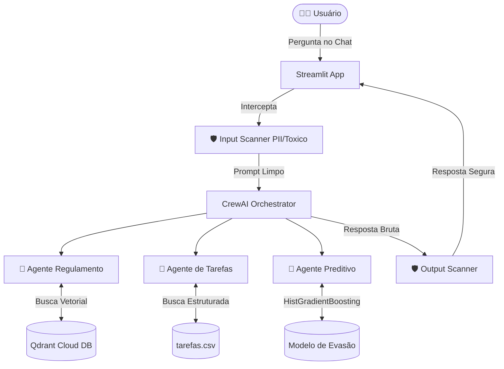

# StudyFlow AI 🎓


**StudyFlow AI** é um assistente acadêmico inteligente desenvolvido para resolver o desafio de organização de estudos, tarefas e notas universitárias. Construído usando a metodologia **Challenge-Based Learning (CBL)**, ele funciona como um orquestrador centralizado que combina Retrieval-Augmented Generation (RAG) e Machine Learning para entregar previsões e análises contextuais precisas.

## 🎯 O Desafio (CBL)
Estudantes universitários frequentemente lutam com prazos espremidos, acompanhamento de notas fragmentadas e a gestão da sua própria vida acadêmica. A ausência de um "Painel de Controle" unificado gera estresse e evasão.

**A Solução:** Um assistente via Chat (RAG) que responde dúvidas do regulamento com precisão, avisa sobre tarefas pendentes, e utiliza Inteligência Artificial Preditiva para calcular o Risco de Evasão do aluno com base no seu histórico atual.

---

## 🏗️ Arquitetura do Sistema

O StudyFlow utiliza **CrewAI** para orquestrar múltiplos Agentes autônomos que cooperam entre si.



---

## 🛠️ Stack Tecnológica
*   **Frontend**: Streamlit
*   **Orquestração de Agentes**: CrewAI
*   **LLM Gateway**: LiteLLM (Conectado ao Qwen2.5 7B rodando localmente via LM Studio)
*   **Vector Database**: Qdrant Cloud (Cloud DB hospedado para alta performance)
*   **Machine Learning**: Scikit-Learn (HistGradientBoosting)
*   **Telemetria / Observabilidade**: Langfuse
*   **Avaliação de LLM**: DeepEval (Métricas de Fidelidade e Relevância)
*   **Segurança**: Custom Security Pipeline (Regex / Heuristics) substituindo LLM Guard para máxima compatibilidade local.

---

## 🚀 Como Executar Localmente

### 1. Pré-requisitos
*   **Python 3.10+** (Recomendado usar Anaconda)
*   **LM Studio** rodando na porta `1234` com o modelo Qwen (ou equivalente).
*   Uma conta no **Langfuse** para observabilidade.

### 2. Instalação
Clone o repositório e instale as dependências:
```bash
git clone https://github.com/seu-usuario/studyflow-ai.git
cd studyflow-ai
pip install -r requirements.txt
```

### 3. Variáveis de Ambiente
Crie um arquivo `.env` na raiz do projeto, usando o `.env.example` como base:
```env
LM_STUDIO_BASE_URL=http://localhost:1234/v1
LANGFUSE_SECRET_KEY=sk-lf-...
LANGFUSE_PUBLIC_KEY=pk-lf-...
LANGFUSE_BASE_URL=https://us.cloud.langfuse.com
QDRANT_URL=https://...
QDRANT_API_KEY=...
```

### 4. Executando
Basta subir o servidor do Streamlit:
```bash
streamlit run app.py
```

---

## 🔒 Segurança e Guardrails
O projeto implementa uma pipeline de segurança `security.py` robusta que intercepta as mensagens:
*   **Anonimização de PII**: CPFs, Telefones e Emails são mascarados ANTES de irem para o LLM.
*   **Ban Topics**: Tópicos como política, violência e dicas médicas/financeiras são estritamente bloqueados.
*   **Anti-Jailbreak**: Bloqueio de prompts que tentam forçar o modelo a "ignorar as regras".

---

## ⚠️ Limitações Conhecidas
*   **Hardware Local**: O sistema foi projetado para rodar offline usando *LM Studio*, dependendo da placa de vídeo do usuário. Respostas podem ser mais lentas em hardware sem aceleração (sem GPU).
*   **Tamanho de Contexto**: A limitação de VRAM local restringe o tamanho do RAG. Por isso, migramos de Chroma local para o *Qdrant Cloud* para aliviar o peso de indexação da máquina host.
